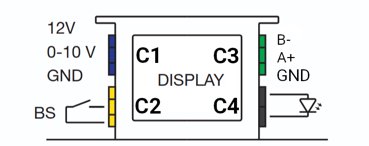
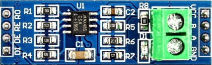
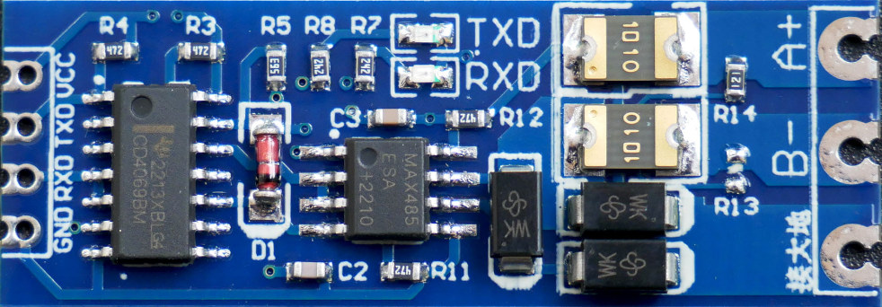

## ESPHome Zehnder ComfoAir E300/E400
ESPHome component for communication with the Zehnder ComfoAir E300/E400 heat recovering ventilation units. This module allows for reading sensor states into Home-assistant.

### Setup 
The unit uses RS485 serial communication at 19200:8:EVEN:1. Connect using a twisted pair wired to the C3 port on the Zehnder unit.

The C3 connector is located at the top right of display. To access it, remove the cover surrounding the display by removing three Torx screws. 
The pin-out is shown in the image below:


| Connector | Description                                             |
|-----------|---------------------------------------------------------|
| C1        | Analog (0-10 V) control input                           |
| C2        | Bathroom switch                                         |
| C3        | RS485 serial interface                                  |
| C4        | Malfunction indicator (5V when malfunction is detected) |

### Hardware
The example hardware is based on a nodeMCU V2 and a MAX485 module that converts the RS485 signal to UART. Two different type of modules are available, with and without automatic flow control.

| Without automatic flow control                    | With automatic flow control                    |
| --------------------------------------------------|------------------------------------------------|
|  |  |

Note that the pin-out is different. The module with automatic flow control has input pins labeled TDX and RDX while the module without automatic flow control has pins labeled DI, RO, RE and DE.

In order to connect the MAX485 module to the nodeMCU the following mapping can be used. 

| nodeMCU | MAX485 | MAX485 (w/o flow control) |
|---------|--------|---------------------------|
| GPI01   | TDX    | DI (Driver Input)         |
| GPI03   | RDX    | RO (Receiver Output)      |
| GPIO2   | -      | RE (Receiver Enable)      |
| GPIO2   | -      | DE (Driver Enable)        |

Next, connect the VCC and GND pins. Finally, the A+ and B- ports of the MAX485 module should be connected to the A+ and B- ports on the C3 connector using a twisted pair. 

### Example of minimal configuration yaml
```yaml
substitutions:
  tx_pin: GPIO01
  rx_pin: GPIO03
  update_interval: 15s

packages:
  remote_package:
    url: https://github.com/CodedCactus/zehnder-comfoair
    ref: main
    files: [components/zehnder.yaml]
    refresh: 0s
    
logger:
  baud_rate: 0 # disable logger for hardware UART support
```

### Registry table
The following data fields have been identified on from the holding registers. Currently, all registers are read-only.

| Adress | Name                                | Datatype | Unit | Scale | Note                     |
|--------|-------------------------------------|----------|------|-------|--------------------------|
| 0x136  | Exhaust fan duty cycle              | U_WORD   | %    | 10    |                          |
| 0x137  | Supply fan duty cycle               | U_WORD   | %    | 10    |                          |
| 0x138  | Exhaust fan flow rate               | U_WORD   | m³/h | 1     |                          |
| 0x139  | Supply fan flow rate                | U_WORD   | m³/h | 1     |                          |
| 0x13A  | Exhaust fan speed                   | U_WORD   | RPM  | 1     |                          |
| 0x13B  | Supply fan speed                    | U_WORD   | RPM  | 1     |                          |
| 0x12C  | Outdoor air temperature             | S_WORD   | °C   | 10    |                          |
| 0x12D  | Pre-heater temperature              | S_WORD   | °C   | 10    |                          |
| 0x12F  | Supply air temperature              | S_WORD   | °C   | 10    |                          |
| 0x130  | Extract air temperature             | S_WORD   | °C   | 10    |                          |
| 0x131  | Exhaust air temperature             | S_WORD   | °C   | 10    |                          |
| 0x132  | Outdoor humidity                    | U_WORD   | %    | 10    |                          |
| 0x133  | Supply humidity                     | U_WORD   | %    | 10    |                          |
| 0x134  | Extract humidity                    | U_WORD   | %    | 10    |                          |
| 0x135  | Exhaust humidity                    | U_WORD   | %    | 10    |                          |
| 0x141  | Exhaust fan flow rate setpoint      | U_WORD   | m³/h | 1     |                          | 
| 0x140  | Supply fan flow rate setpoint       | U_WORD   | m³/h | 1     |                          |
| 0x148  | Analog (0-10 V) control setpoint    | U_WORD   | %    | 1     | 0:low;50:medium;100:high |
| 0x149  | RF control setpoint                 | U_WORD   | %    | 1     | 0:low;50:medium;100:high |
| 0x14A  | 3-way switch control setpoint       | U_WORD   | %    | 1     | 0:low;50:medium;100:high |
| 0x14B  | Bathroom switch control setpoint    | U_WORD   | %    | 1     | 0:low;50:medium;100:high |
| 0x13C  | Analog (0-10 V) input voltage       | U_word   | V    | 100   | steering signal (0-10V)  |
| 0x13D  | RF input voltage                    | U_WORD   | V    | 100   | steering signal (0-10V)  |
| 0x13E  | RF input enabled                    | U_WORD   | -    | -     | 0:off;1:on               |
| 0x13F  | Pre-heater active                   | U_WORD   | -    | -     | 0:off;1:on               |
| 0x152  | Pre-heater present*                 | U_WORD   | -    | -     | 0:absent;1:present       |
| 0x151  | Fireplace mode*                     | U_WORD   | -    | -     | 0:off;1:on               |
| 0x06E  | Firmware version                    | U_WORD   | -    | -     | 20800 = 2.8.0            |

*Only available on later firmware versions (confirmed on 2.8.0)