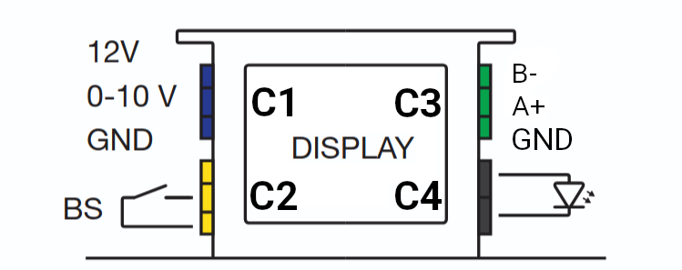
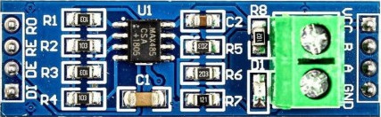
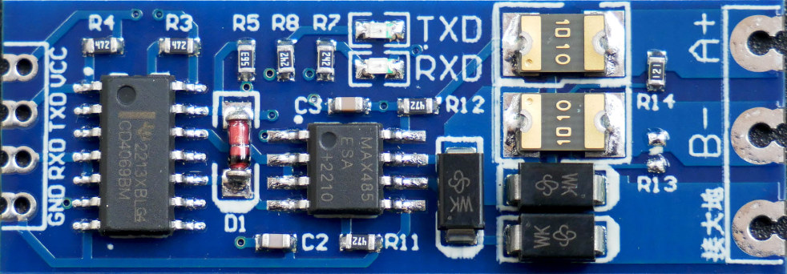

## ESPHome Zehnder ComfoAir E300/E400
Interact with Zehnder ComfoAir E300/E400 using ESPHome and Home Assistant. This ESPHome component allows interaction with the Zehnder ComfoAir E300/E400 heat recovering ventilation units. Sensor states are read using modbus RTU, while the unit is controlled using the analog input.

### Setup 
The component uses modbus RTU serial communication over RS485 to interface with the ventilation unit, furthermore the analog input on the C1 connector is used to control the ventilation level. The serial communication is available on the C3 connector. The serial configuration is shown in the following table:

| Baud rate | Word length | Parity | Stop bits |
|-----------|-------------|--------|-----------|
| 19200     | 8           | EVEN   | 1         |

The C3 connector is located at the top right of display. To access it, remove the cover surrounding the display by removing three Torx screws. 
The pin-out is shown in the image below:



| Connector | Description                                             |
|-----------|---------------------------------------------------------|
| C1        | Analog (0-10 V) control input                           |
| C2        | Bathroom switch                                         |
| C3        | RS485 serial interface                                  |
| C4        | Malfunction indicator (5V when malfunction is detected) |

### Hardware
The example hardware is based on a nodeMCU V2 and a MAX485 module that converts the RS485 signal to UART. 

Since the RS485 connection is half-duplex, it cannot send and receive data at the same time, unlike UART. To overcome this issue, the module uses flow control to determine if it should be sending or receiving data. Two different types of module are available, with and without automatic flow control.

| Without automatic flow control                    | With automatic flow control                    |
| --------------------------------------------------|------------------------------------------------|
|  |  |

Note that the pin-out is different. The module with automatic flow control has input pins labeled TDX and RDX while the module without automatic flow control has pins labeled DI, RO, RE and DE.

Both modules can be used in this project, the only difference being the availability of the module, and the requirement for an additional free pin.

In order to connect the MAX485 module to the nodeMCU the following mapping can be used. 

| nodeMCU | MAX485 | MAX485 (w/o flow control) |
|---------|--------|---------------------------|
| GPI01   | TDX    | DI (Driver Input)         |
| GPI03   | RDX    | RO (Receiver Output)      |
| GPIO5   | -      | RE (Receiver Enable)      |
| GPIO5   | -      | DE (Driver Enable)        |
| 5V      | VCC    | VCC                       |
| GND     | GND    | GND                       |

Finally, the A+ and B- ports of the MAX485 module should be connected to the A+ and B- ports on the C3 connector using a twisted pair. 


### Fan control
In order to control the fan state, the analog (0-10V) input on the C1 connector is used. Since the ESP chip can only provide 3.3V, the `max instelling` on the unit must be lowered to 3.1V. This will make sure that the unit interprets 3.3.V as the maximum ventilation level. The setting is located at ``menu -> login(pwd 4210) -> analog 0-10V -> max. instelling``.

Three options are available. On the ESP8266, software PWM can be used to generate the required signal. On the ESP32, the built-in DAC can be used. Finally, an external DAC can be used (e.g. DFRobot Gravity GP8211S DAC Module). This is is especially useful if you are using the ComfoConnect Splitter in combination with multiple wired 0-10V input. In this case an external DAC is needed that can supply 10V.

### Schematic
The following schematic shows how to connect the hardware.

```
+---------------+                                    +-------------+
|         12V   |                                    |             |
|   C1    0-10V o------------------------------------o GPIOxx      |
|         GND   o------------------------------------o GND         |
|  [ComfoAir    |                                    |             |
|   E300/E400]  |       +--------------------+       |    [ESP]    |
|         B-    o-------o B-             VCC o-------o 5V          |
|   C3    A+    o-------o A+             GND o-------o GND         |
|         GND   |       |      [MAX485]      |       |             |
+---------------+       |                 TX o-------o TXD         |
                        |                 RX o-------o RXD         |
                        +--------------------+       +-------------+
```

### Example of minimal configuration yaml

```yaml
substitutions:
  tx_pin: GPIO01
  rx_pin: GPIO03
  update_interval: 15s
  fan_output: fan_output

# modbus: # uncomment for MAX485 chip without automatic flow control
#   flow_control_pin: GPIO05

packages:
  remote_package:
    url: https://github.com/CodedCactus/zehnder-comfoair
    ref: main
    files: [components/zehnder.yaml,
            components/fan.yaml] # commend out the fan.yaml if you don't want fan control
    refresh: 0s
    
output: 
- platform: esp8266_pwm
  pin: GPIO5
  frequency: 1kHz
  id: fan_output

logger:
  baud_rate: 0 # disable logger for hardware UART support
```

On ESP32 the output can be configured as follows:

```yaml
output:
  - platform: esp32_dac
    pin: GPIO25
    id: fan_output
```

### Registry table
The following data fields have been identified from the holding registers. Currently, all registers are read-only.

| Address | Name                             | Datatype | Unit | Scale | Note                                                                  |
|-------- |----------------------------------|----------|------|-------|-----------------------------------------------------------------------|
| 0x065   | Device Status                    | U_WORD   | -    | -     | 0: Error; 2: Self Test; 10: Normal; 20: Standby; 42: Maintenance Mode |
| 0x06E   | Firmware version                 | U_WORD   | -    | -     | 20800 = 2.8.0                                                         |
| 0x06F   | Orientation                      | U_WORD   | -    | -     | 0:Right; 1:Left                                                       |
| 0x070   | Model                            | U_WORD   | -    | -     | 0:E300 P; 2:E300 RF; 3:E400 RF                                        |
| 0x12C   | Outdoor temperature              | S_WORD   | °C   | 10    |                                                                       |
| 0x12D   | Pre-heater temperature           | S_WORD   | °C   | 10    |                                                                       |
| 0x12F   | Supply temperature               | S_WORD   | °C   | 10    |                                                                       |
| 0x130   | Extract temperature              | S_WORD   | °C   | 10    |                                                                       |
| 0x131   | Exhaust temperature              | S_WORD   | °C   | 10    |                                                                       |
| 0x132   | Outdoor humidity                 | U_WORD   | %    | 10    |                                                                       |
| 0x133   | Supply humidity                  | U_WORD   | %    | 10    |                                                                       |
| 0x134   | Extract humidity                 | U_WORD   | %    | 10    |                                                                       |
| 0x135   | Exhaust humidity                 | U_WORD   | %    | 10    |                                                                       |
| 0x136   | Exhaust fan duty cycle           | U_WORD   | %    | 10    |                                                                       |
| 0x137   | Supply fan duty cycle            | U_WORD   | %    | 10    |                                                                       |
| 0x138   | Exhaust flow rate                | U_WORD   | m³/h | 1     |                                                                       |
| 0x139   | Supply flow rate                 | U_WORD   | m³/h | 1     |                                                                       |
| 0x13A   | Exhaust fan speed                | U_WORD   | RPM  | 1     |                                                                       |
| 0x13B   | Supply fan speed                 | U_WORD   | RPM  | 1     |                                                                       |
| 0x13C   | Analog (0-10 V) input voltage    | U_WORD   | V    | 100   | Steering signal (0-10V)                                               |
| 0x13D   | RF input voltage                 | U_WORD   | V    | 100   | Steering signal (0-10V)                                               |
| 0x13E   | RF input enabled                 | U_WORD   | -    | -     | 0:Off; 1:On                                                           |
| 0x13F   | Pre-heater status                | U_WORD   | -    | -     | 0:Off; 1:On                                                           |
| 0x140   | Supply flow rate setpoint        | U_WORD   | m³/h | 1     |                                                                       |
| 0x141   | Exhaust flow rate setpoint       | U_WORD   | m³/h | 1     | Balance off-set is applied to this setpoint                           | 
| 0x145   | Bypass motor active              | U_WORD   | -    | 1     | 0:Off; 1:One on; 2:Both on                                            |
| 0x146   | Bypass setpoint                  | U_WORD   | %    | 1     | 0:Closed; 100:Fully open                                              |
| 0x147   | Bypass position                  | U_WORD   | %    | 1     | 0:Closed; 100:Fully open                                              |
| 0x148   | Analog (0-10 V) control setpoint | U_WORD   | %    | 1     | 0:Low; 50:Medium; 100:High                                            |
| 0x149   | RF control setpoint              | U_WORD   | %    | 1     | 0:Low; 50:Medium; 100:High                                            |
| 0x14A   | 3-way switch control setpoint    | U_WORD   | %    | 1     | 0:Low; 50:Medium; 100:High                                            |
| 0x14B   | Bathroom switch control setpoint | U_WORD   | %    | 1     | 0:Low; 50:Medium; 100:High                                            |
| 0x152   | Pre-heater present*              | U_WORD   | -    | -     | 0:Absent; 1:Present                                                   |
| 0x151   | Fireplace mode*                  | U_WORD   | -    | -     | 0:Off; 1:On                                                           |

*Only available on later firmware versions (confirmed on 2.8.0)
